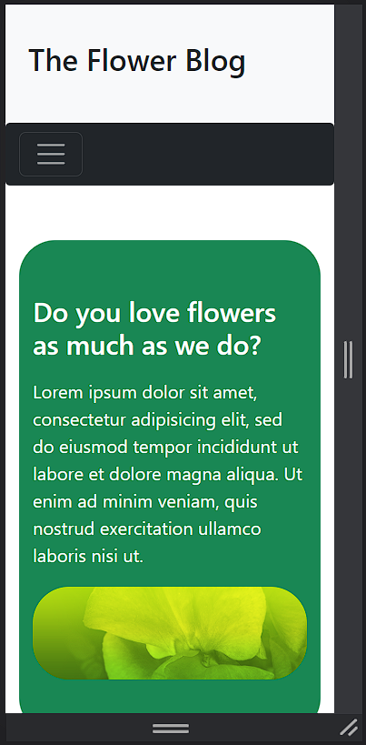
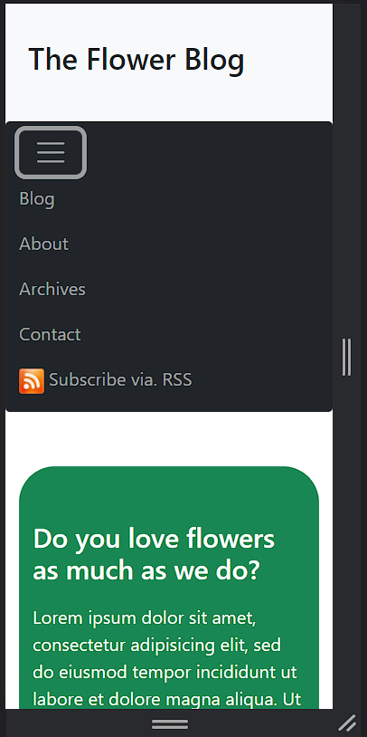
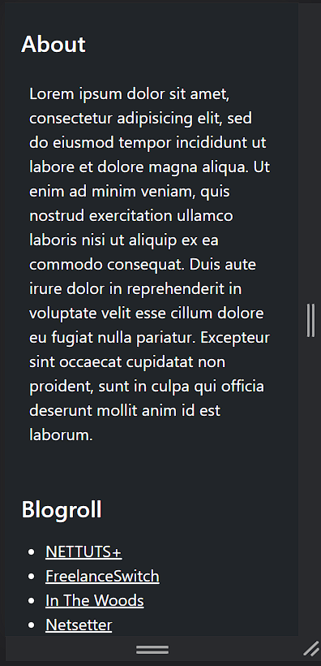
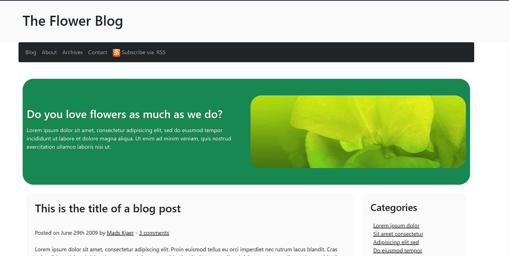

# The Flower Blog

It's a task for simulating an old-non-responsive web page through using Bootstrap technology to make it responsive.

## Table of Contents

- [Features](#features)
- [Screenshots](#screenshots)
- [Installation](#installation)
- [Usage](#usage)
- [Contributing](#contributing)
- [License](#license)

## Features

- Responsive and visually appealing design
- Dedicated sections for blog posts, comments, categories, and archives
- User-friendly navigation with a collapsible navbar
- Easily customizable to suit your branding and content

## Screenshots

## Installation

1. Clone the repository to your local machine.
2. `npm install`
3. `npm run dev`
